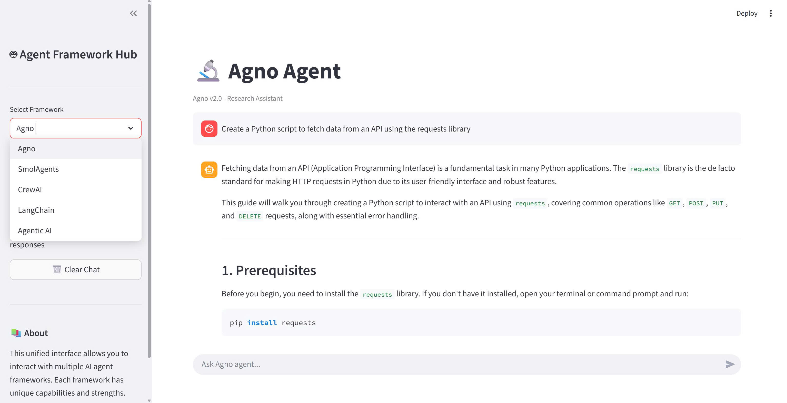

# Multi-Agent Framework Collection

A comprehensive collection of AI agent implementations using various modern frameworks, all accessible through a unified web interface.



## Overview

This project showcases five different AI agent frameworks, each with unique capabilities and strengths. All agents are powered by Google Gemini and can be accessed through a single Streamlit web interface.

## Frameworks Included

- **🔬 Agno** - Research assistant with knowledge-based responses
- **🤖 SmolAgents** - Lightweight agent with web search and webpage visiting
- **🚀 CrewAI** - Multi-agent system for deep research and synthesis
- **🔗 LangChain** - Tool-enabled agent with web search and calculator
- **🧠 Agentic AI** - Intelligent decision-making agent with smart tool selection

## Quick Start

1. **Install dependencies:**
   ```bash
   pip install agno smolagents crewai langchain streamlit python-dotenv google-generativeai duckduckgo-search
   ```

2. **Set up your API key:**
   Create a `.env` file with:
   ```
   GOOGLE_API_KEY=your_api_key_here
   ```

3. **Run the unified interface:**
   ```bash
   streamlit run streamlit_unified_agents.py
   ```

4. **Or run individual agents:**
   ```bash
   python agno_agent.py
   python smol_agent.py
   python Crew_Agent.py
   streamlit run agent.py
   python agentic_ai.py
   ```

## Features

- 🎨 **Unified Web Interface** - Switch between frameworks seamlessly
- 💬 **Chat History** - Separate conversation history for each framework
- 🔄 **Lazy Loading** - Agents initialize only when needed
- 🛠️ **Tool Integration** - Web search, calculators, and more
- 📊 **Multi-Agent Workflows** - CrewAI enables collaborative agent teams

## Project Structure

```
agentic/
├── streamlit_unified_agents.py  # Unified web interface
├── agno_agent.py                # Agno framework agent
├── smol_agent.py                # SmolAgents framework
├── Crew_Agent.py                # CrewAI multi-agent system
├── agent.py                     # LangChain agent (Streamlit)
├── agentic_ai.py                # Decision-making agent
└── public/
    └── agentic.jpg              # Project image
```

## Use Cases

- **Research & Information Gathering** - Use Agno or SmolAgents for quick answers
- **Deep Analysis** - Use CrewAI for comprehensive research reports
- **Tool-Based Tasks** - Use LangChain for calculations and web searches
- **Intelligent Decision Making** - Use Agentic AI for complex problem-solving

## Tech Stack

- **LLM**: Google Gemini 2.5 Flash
- **Frameworks**: Agno, SmolAgents, CrewAI, LangChain
- **UI**: Streamlit
- **Tools**: DuckDuckGo Search, Web Scraping, Calculators

---

Built with ❤️ using modern AI agent frameworks

